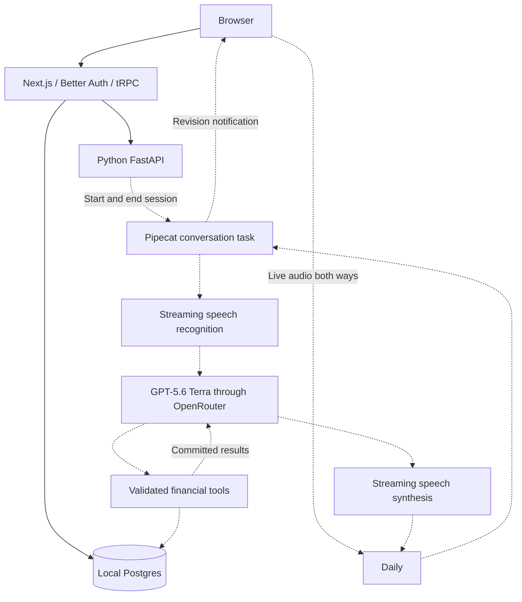

# System map and credential handoff

Current delivery target: local `docker compose up --build`, serving http://localhost:3000, with Track A conversational intelligence. RDS, Supabase, Convex and cloud deployment are outside the current scope. No hosted database was connected.

## Implemented software

- Browser: Next.js/React, shadcn/ui, Motion and ThinkingOrb.
- Authentication: Better Auth email/password accounts and database-backed sessions; optional Google wiring.
- Application API: authenticated tRPC in Next.js, calling internal FastAPI through generated OpenAPI types.
- Database: PGlite for the current local development fallback; Compose defines native Postgres.
- Python currently returns an empty workspace. Voice and financial calculations/persistence are pending.

## Proposed voice architecture

See [conversation architecture](conversation-architecture.md) for the cascade/realtime comparison, source review, acceptance cases and limits. The user selected the cascade for the first implementation; continue in WSL and defer a Realtime comparison until time permits.

Solid arrows are implemented; dashed arrows are proposed. The SQL database in the diagram is the Compose target; the running fallback uses PGlite. Tools, turn handling and Pipecat belong to the Python service and do not require separate servers. Cards refetch authoritative state through the application API after revision notifications. Both speech and cards must use the same computed result.

## Environment status

Presence checked on 2026-09-11 without displaying secret values. Presence is not evidence of working provider access.

| Configuration | State |
| --- | --- |
| `BETTER_AUTH_SECRET`, `INTERNAL_API_SECRET` | Generated locally; used by the scaffold |
| `DATABASE_URL` | Local development database |
| `POSTGRES_USER`, `POSTGRES_PASSWORD`, `POSTGRES_DB` | Local Compose defaults |
| `APP_ORIGIN`, `BETTER_AUTH_URL`, `AGENT_API_URL` | Local service addresses |
| `DAILY_API_KEY` | Present; live room/voice integration pending |
| `SARVAM_API_KEY` | Present; adapter pending |
| `ELEVENLABS_API_KEY` | Present; adapter and voice selection pending |
| `OPENAI_API_KEY` | Present; direct Realtime alternative not tested |
| `OPENROUTER_API_KEY` | Present; text LLM integration pending |
| Google client ID/secret | Optional; not needed for assignment completion |

Store credentials in ignored root `.env`; send variable names rather than values in the conversation. Select an accessible ElevenLabs voice ID during the first voice implementation. No new hosted-database or cloud-hosting keys are required. Local startup still needs internet for Daily and AI services.

Google's optional authorized redirect is `http://localhost:3000/api/auth/callback/google`. No further auth feature work is on the critical path.

## Startup and verification

Compose configuration validates. Docker startup is unverified because this machine's Docker Desktop Linux engine is unavailable. The local fallback is documented in the root README. The current scaffold has passed authentication/unit/browser checks; live conversation and financial acceptance cases have not run.
