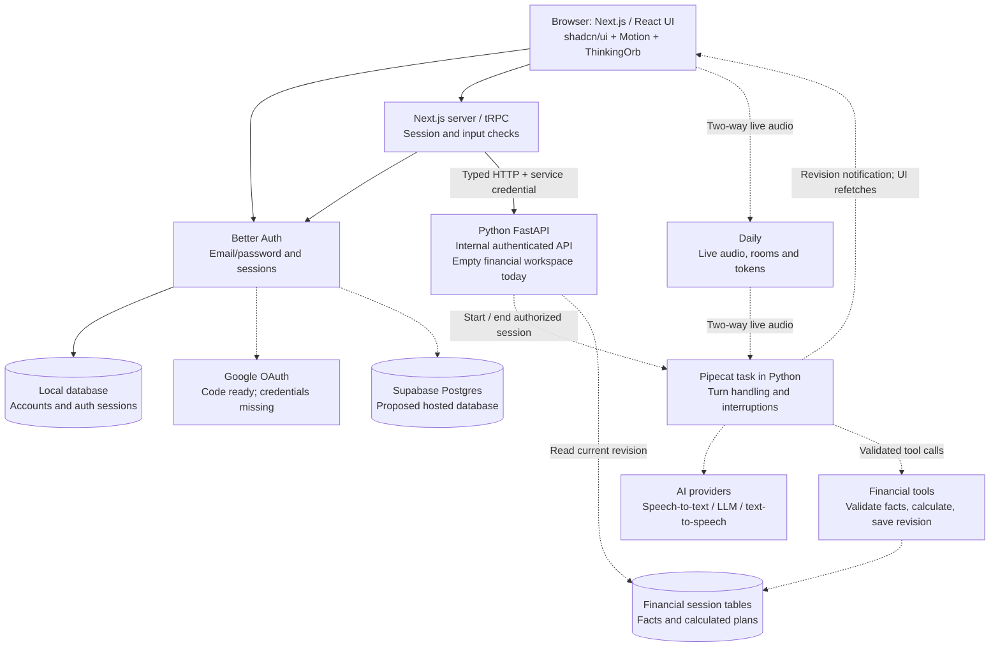

# System map and credential handoff

Snapshot: 2026-09-11. Configured means a nonempty local value was found; it does not establish provider authentication or a completed integration. Secret values are deliberately excluded.

## Environment status

| Configuration | Current state | Next step |
| --- | --- | --- |
| `BETTER_AUTH_SECRET` | Generated locally; auth uses it | No user-supplied key needed |
| `INTERNAL_API_SECRET` | Generated locally; web and Python use it | No user-supplied key needed |
| `DATABASE_URL` | Local development database configured | Replace for optional Supabase connection after project details arrive |
| `POSTGRES_USER`, `POSTGRES_PASSWORD`, `POSTGRES_DB` | Local Compose defaults | These are development settings, not Supabase credentials |
| `APP_ORIGIN`, `BETTER_AUTH_URL`, `AGENT_API_URL` | Local service addresses configured | Change with hosting configuration |
| `GOOGLE_CLIENT_ID`, `GOOGLE_CLIENT_SECRET` | Empty; auth integration implemented | Supply both and configure Google redirect |
| `DAILY_API_KEY` | Empty; placeholder only | Supply key; implement room/token creation and Pipecat lifecycle |
| Speech recognition / LLM / speech synthesis credentials | No providers selected or adapters connected | Select providers, add their exact variables and integrations |

Put credentials in the ignored root `.env` rather than the conversation archive. Report variable names that were populated, not their values.

## Software flow

Solid arrows show implemented connections. Dashed arrows show proposed connections. Local auth uses PGlite for development; Compose defines native Postgres but has not been run successfully on this machine.

The two database boxes for accounts and financial sessions represent different data responsibilities; both can live in the same Postgres database. Pipecat and the calculation engine are planned Python components, not separate microservices. Audio does not travel through tRPC.

## Supabase recommendation, not a recorded user decision

Use Supabase as hosted Postgres while retaining the working Better Auth integration. Moving to Supabase Auth is another option, but that requires replacing the auth/session integration and testing it again. Supabase's project URL and publishable/anon key alone are not the database connection credentials our existing `pg` client needs.

For this design, obtain a database connection URI from the project's **Connect** dialog, including the database password. For this persistent local backend on an IPv4 network, the session pooler is suitable; direct connections are appropriate where IPv6 is available. Configure TLS and validate connectivity when wiring it. No Supabase service-role or management token is needed for this proposed Postgres-only integration. [Supabase connection documentation](https://supabase.com/docs/guides/database/connecting-to-postgres).

Compose currently supplies its own local database URL. Hosted database support needs an explicit Compose override rather than assuming a change to root `DATABASE_URL` changes Compose. Keep the local database path available for reviewer reproducibility. Use a dedicated assignment project/database for migrations; inspect the target before applying them.

## Google and voice handoff

Google's authorized redirect for the current auth implementation is `http://localhost:3000/api/auth/callback/google`. Configure the consent screen and test users where applicable. [Better Auth Google documentation](https://better-auth.com/docs/authentication/google).

Daily supplies audio transport and room infrastructure. Pipecat is the Python framework that connects streaming speech recognition, a language model, speech synthesis, conversation state and tools. A Daily key alone does not configure those AI providers. Provider choices and credentials are still required; a realtime model is an alternative pipeline design to discuss before implementation. [Pipecat introduction](https://docs.pipecat.ai/pipecat/get-started/introduction), [Daily SDK](https://docs.daily.co/docs/daily-js/introduction).

## Next architecture discussion

Proposed robustness priorities: one user-owned session and revisioned state; deduplicated fact updates; deterministic arithmetic; expired-room and disconnect cleanup; bounded provider timeouts; explicit failed/incomplete states; and UI refetch after a lost revision notification. These are targets, not implemented guarantees.

Candidate demo cases: salary/gig correction, uncertain receivable, payment due before income, ambiguous amount clarification, reconnect without duplicate facts, and provider failure without a fabricated plan. The existing scenario matrix contains the broader proposed coverage.
